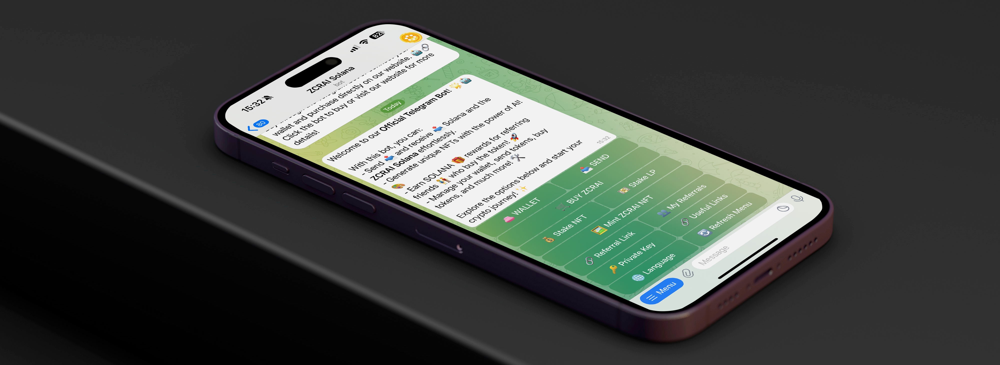

# 🤖 Telegram Bot

<figure><figcaption></figcaption></figure>

### Introduction 🌟

The ZCRAI Solana Telegram bot is an innovative tool that functions as a decentralized wallet directly on Telegram. With this bot, users can buy ZCRAI tokens, send and receive SOL (the native cryptocurrency of Solana) and ZCRAI, as well as have the opportunity to generate income through a referral system. On this page, you will learn how to use the bot to manage your assets and take advantage of the functionalities it offers.

### Setting Up the Bot 🛠️

To start using the ZCRAI Solana Telegram bot, follow these steps:

1. Access the bot link: https://t.me/ZCRAISolBot.
2. On Telegram, start a conversation with the bot by clicking on "Start" or "Iniciar".
3. The bot will provide instructions to set up your wallet, including creating or importing a private key.

### Private Key Access 🔐

With the ZCRAI Solana bot, you have full access to your private key. This means you have complete control over your assets and can import your wallet on any other platform compatible with Solana. Make sure to keep your private key in a secure location and never share it with anyone.

### Buying ZCRAI 💰

To buy ZCRAI tokens through the bot, follow the instructions provided by the bot. You will be able to make the purchase using SOL. The process is intuitive and designed to be accessible even to beginner users.

### Sending and Receiving SOL and ZCRAI 💸

The bot allows you to send and receive SOL and ZCRAI quickly and conveniently. To make a transfer, just follow the bot's commands and enter the recipient's wallet address. To receive, provide your Solana wallet address to the sending party.

### Generating Income with the Referral System 🤑

The ZCRAI Solana Telegram bot offers a referral system that allows you to earn rewards each time someone uses your referral link to make a purchase. To participate:

1. Request your exclusive referral link through the bot.
2. Share your link with friends and acquaintances interested in buying ZCRAI.
3. Earn a commission for each purchase made through your link, with no limits.

### Conclusion 🎉

The ZCRAI Solana Telegram bot is a convenient and secure way to manage your assets on the Solana network. With access to your private key, ease of transactions, and a profitable referral system, the bot makes the experience of investing in ZCRAI accessible and rewarding. Always remember to practice good security measures and never share your private keys.

To start using the bot and explore all its features, visit the [ZCRAI Solana Bot](https://t.me/ZCRAISolBot) on Telegram. 🚀
