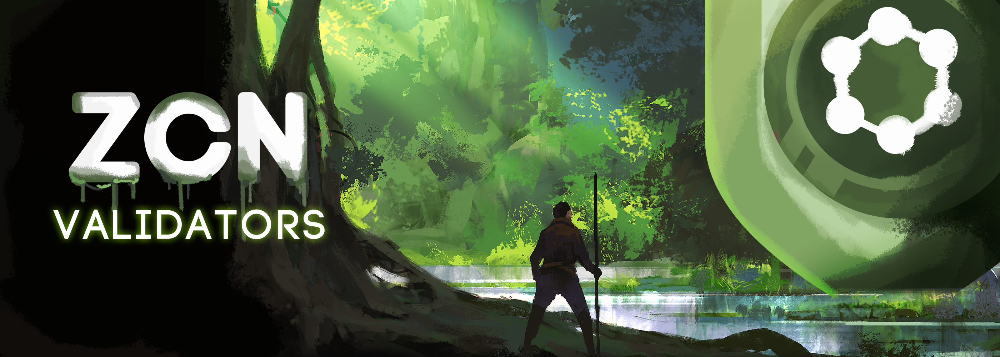

# ✅ Validators

<figure><figcaption></figcaption></figure>

## The ZCN Network Validator System 🌐

The ZCN Network offers an innovative validation system 🚀, combining the reliability of blockchain technology with the exclusivity of NFTs.

### Limitation and Representation of Validators 🔒

With a strategic limit of 40 validators, the ZCN network ensures a balanced distribution of validation power. These validators are embodied by "ZCN Validators" NFTs, promoting a fair and controlled governance system.

### Requirements to Be a Validator 🛠️

To become a validator on the ZCN Network, you need:

* **Validator NFT:** Own an NFT from the ZCN Validators collection.
* **ZCR Stake:** Perform a minimum stake of 10 million ZCR.
* **Technical Infrastructure:** Maintain an active VPS (Virtual Private Server) with the validation software.

### Reward Mechanics and Validation Process 💰

Validators are rewarded for each validated block, following a queue system that ensures an equitable distribution of rewards. Additionally, validators also receive 1% of ZCR sales on the Binance Smart Chain (BSC), providing an additional income stream on both the BSC and ZCN networks.

### Acquiring a Validator NFT 🛒

Those interested in acquiring a Validator NFT and joining the exclusive group of ZCN validators should contact the ZCore team via email: [info@zcore.network](mailto:info@zcore.network).

### Conclusion ✨

The ZCN Network's validator system is a perfect harmony of innovation and blockchain technology, creating a secure and efficient environment. The integration of NFTs brings a unique element and provides a robust validation system. With the advantage of earnings on the ZCN network and participation in sales on the BSC, validators play a vital role in maintaining the integrity and advancing the ZCore ecosystem. 🌟
