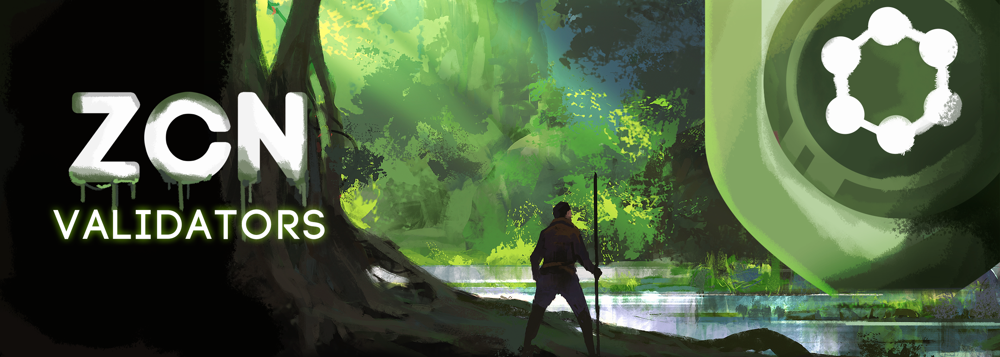

# ✅ NFT Validators

<figure><figcaption></figcaption></figure>

**Introdução ao Conceito de NFT Validators**

A ZCore tem o prazer de apresentar sua exclusiva coleção de NFT Validators, uma iniciativa pioneira no mundo das criptomoedas e da tecnologia blockchain. Esta coleção representa não apenas um ativo digital único, mas também uma chave para participar ativamente na validação e no suporte da rede ZCore Network (ZCN).

> :arrow\_right: Informações sobre Validadores ZCN
>
> [validadores.md](zcore-evm-zcn/validadores.md "mention")

**Aquisição de NFT Validators: O Caminho Através de NFTs Lendários**

Para se tornar um detentor de um NFT Validator, é essencial primeiro possuir um NFT lendário da ZCore. Esta pré-requisito assegura que apenas os participantes mais comprometidos e dedicados tenham a oportunidade de adquirir um NFT Validator. Cada NFT lendário é elegível para ser trocado por um NFT Validator, estabelecendo um caminho exclusivo e valioso para os entusiastas da criptomoeda.

> :arrow\_right: Informações sobre a Coleção Farm Horses
>
> [nft-farm-horses.md](nft-farm-horses.md "mention")

**Privilegios e Benefícios dos Detentores de NFT Validators**

Uma vez que um indivíduo se torna um detentor de um NFT Validator, ele ganha o poder de validar transações na rede ZCore Network (ZCN). Esta responsabilidade crucial não apenas mantém a integridade e a segurança da rede, mas também permite que os detentores recebam todas as taxas associadas às transações validadas.

Além disso, os detentores de NFT Validators são beneficiados com um rendimento passivo de 1,5% das reflexões da ZCore (ZCR) na rede Binance Smart Chain (BSC). Este mecanismo de reflexão garante que os detentores de NFT Validators sejam continuamente recompensados pelo seu papel crucial na rede, proporcionando um fluxo de renda adicional e incentivando a participação a longo prazo.

> :arrow\_right: Informações sobre as reflexões ZCore (BSC) :&#x20;
>
> [dex.md](token-zcr-bsc/dex.md "mention")

**Conclusão: Um Passo Inovador na Blockchain da ZCore**

A coleção de NFT Validators da ZCore simboliza um marco significativo na interseção da tecnologia blockchain, finanças descentralizadas e arte digital. Oferecendo um equilíbrio único entre participação ativa na rede e benefícios financeiros, esta coleção está destinada a desempenhar um papel fundamental no futuro da ZCore e na evolução do ecossistema de criptomoedas.
